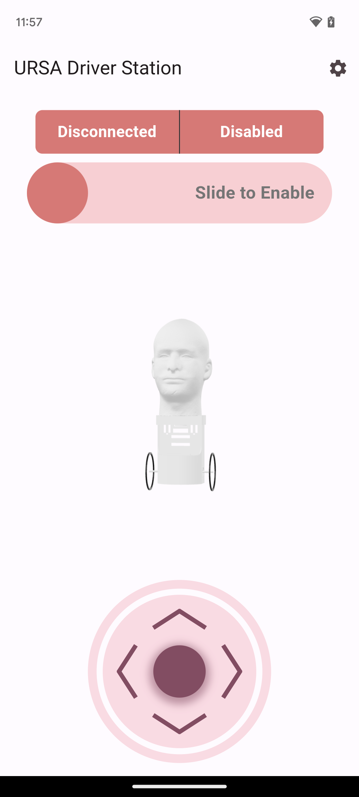
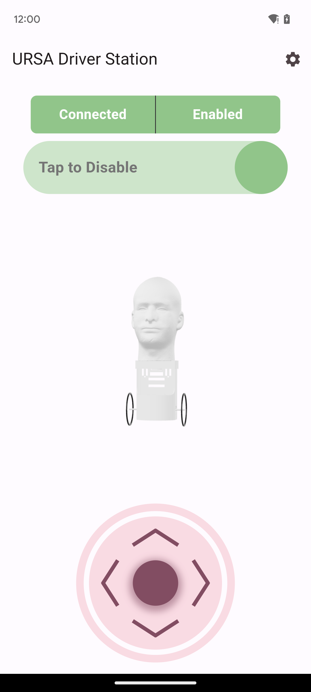
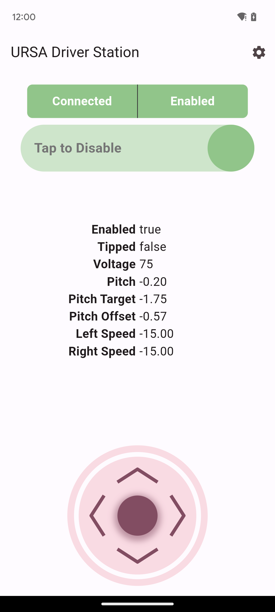

# URSA Driver Station

This app allows control of SERT's URSA (Headbot) robots. Currently, only Android
devices are fully supported. iOS and desktop (macOS, Windows, Linux) should be
mostly functional with few changes. Due to the UDP connection used to
communicate with the robot, web is not currently supported.

## Screenshots

<p align="middle">
  
  
  
</p>

## Getting Started

This project is built in Flutter and Dart. If you don't already have Flutter
installed, follow the instructions
[here](https://flutter.dev/docs/get-started/install).

## Installation and Running

Once Flutter has been installed, you can install this project's dependencies
with:

```bash
$ flutter packages get
```

Then, run the app by executing the following command:

```bash
$ flutter run
```
